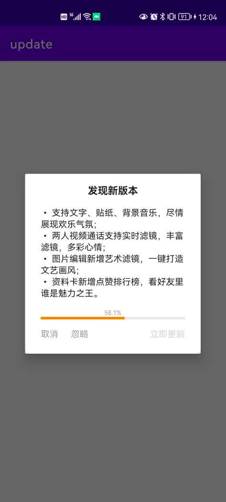

# update

清晰灵活简单易用的应用更新库


- 支持断点续传
- 支持强制安装：不安装无法使用app
- 支持静默更新：不提示用户直接下载安装
- 支持可忽略该版本：忽略后不再提示用户更新该版本
- 支持在通知栏显示下载进度，可监听下载进度
- 支持自定义更新查询
- 支持自定义下载
- 支持自定义提示对话框



## 引入

``` groovy
repositories {
    maven { url "https://gitee.com/ezy/repo/raw/cosmo/"}
}
dependencies {
    implementation "me.reezy.cosmo:update:0.9.1"
}
```

## Usage

``` java
// 设置更新信息源
UpdateManager.setChecker("http://yourdomain.com/path")
```

``` kotlin
// 查询更新
UpdateManager.check(context)
```

``` kotlin
// 在设置界面点击检查更新：默认无新版本时不会提示用户
UpdateManager.check(this) {
    Toast.makeText(this, it.getFullMessage(this), Toast.LENGTH_LONG).show()
}
```

``` kotlin
UpdateManager.setPrompter { activity, agent
    UpdatePromptDialog(activity, it).show()
}

// 自定义更新对话框
UpdateManager.check(this, onPrompt = { activity, agent ->
    UpdatePromptDialog(activity, agent).show()
})
```

``` kotlin
// 清除已经下载好了的包
UpdateManager.clean(context);
```

整个更新流程很简单，具体请看 UpdateExecutor

```
when {
    // 没有新版本 -> 返回结果
    !info.hasUpdate -> returnResult(UpdateResult(UpdateResult.UPDATE_NO_NEWER))
    // 强制更新 -> 提示用户更新，不显示[取消][忽略]按钮
    info.isForce -> prompt(info, task)
    // 静默更新 -> 不提示用户直接更新
    info.isSilent -> update(info, task)
    // 不可忽略的版本 -> 提示用户更新，不显示[忽略]按钮
    !info.isIgnorable -> prompt(info, task)
    // 该版本已经被忽略 -> 返回结果
    info.isIgnored -> returnResult(UpdateResult(UpdateResult.UPDATE_IGNORED))
    // 提示用户更新
    else -> prompt(info, task)
}
```

UpdateInfo

```kotlin
data class UpdateInfo(
    // 是否有新版本
    val hasUpdate: Boolean = false,

    // 是否强制安装：为true时不安装无法使用app
    val isForce: Boolean = false,

    // 是否静默更新：不提示用户直接下载安装
    val isSilent: Boolean = false,

    // 是否可忽略该版本：忽略后不再提示用户更新该版本
    val isIgnorable: Boolean = false,

    // 是否在通知栏显示下载进度：为true时显示
    val isShowNotification: Boolean = true,

    // 更新内容文案
    val updateContent: String = "",

    // 新包下载地址
    val url: String = "",

    // 新包哈希值
    val hash: String = "",
)
```

## LICENSE

The Component is open-sourced software licensed under the [Apache license](LICENSE).